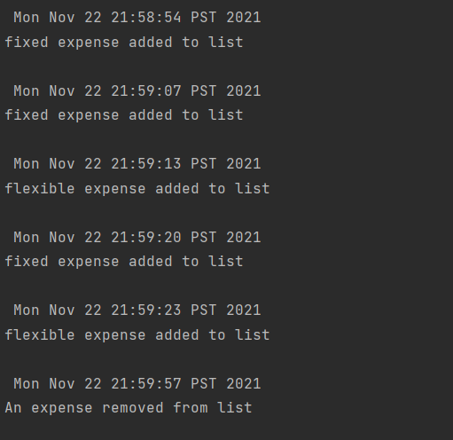

#My Project: Financial Planner
###By Krishnaja Tikkisetty

I will be designing an application that makes a monthly budget for the user. To help this process,
the application will accomplish the following tasks:

-Keep a list of all the user's expenses

-Allow the user to select an expense and add it to their expenses

-Differentiate between *fixed* expenses (such as rent or utilities) and *flexible* expenses
(such as groceries, entertainment, etc)

-Budget according to the user's income

-Allocate reasonable resources to each flexible expense

-Display the budget in a way that is clear to read and understand

I hope my application will be useful to anyone who wants to plan how they spend their money, particularly
people who are in the process of becoming or have only recently become financially independent. 
Post-secondary students come to mind as a notable example. This project is of interest to me because
I would like to explore the process of budgeting. I would like to gain a better understanding of
what makes a "good" budgeting plan and how I can use software construction to achieve a sustainable financial plan
more easily.

##User Stories

-As a user, I want to be able to **add** an expense to a list of my expenses when I click the add expense button

-As a user, I want to be able to **delete** an expense from my list of expenses when I press the delete expense button

-As a user, I want to assign a cost to all of my fixed expenses

-As a user, I want to be able to enter my income

-As a user, I want to be able to view a list of all of my expenses

-As a user, I want to be able to save my budget to file when I press the save button

-As a user, I want to be able to load my budget from file when I press the load button.

-As a user, I want to be able to see my expenses when I press a button

-As a user, I want to see the app logo once I enter my income.

Phase 4: Task 3

When I started this project, I knew that a list of expenses needed to be a part of the app, so I made a separate class
for it. Later on, I decided to add a Budget class so I had a place to associate 
the user's income with all their expenses. 
Early on, it was also clear that I needed an expense class. I wanted the
user to be able to keep track of two different kinds of expenses, fixed and flexible.
Since they shared some behaviour, I decided to make an abstract Expense class for the common
behaviour. The fixed and flexible classes then extended this class. I think this made
differentiating between the different types of expenses easier as I was 
working on my project without introducing unnecessary duplication.
I think my program has minimal coupling for the most part. One thing I would change
is having it so that Expense isn't implementing Writable. Since Budget indirectly has
access to Expenses due to its association with ListOfExpense, I could use this
relationship to call a method similar to ToJson (currently the one in the Expense class)
from the Budget class.

If I had more time to refactor, I would:

- Make it so only Budget had to implement Writable and Expense no longer implements Writable.

